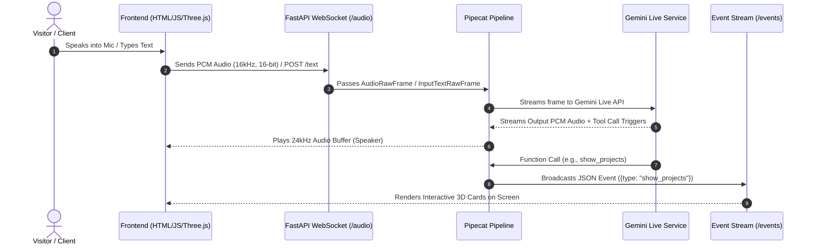

<div align="center">

  <h1>Pradeep Selladurai — 3D Digital Twin & Voice AI Portfolio</h1>
  <p><strong>A real-time, bi-directional speech & text conversational agent powered by FastAPI, Pipecat, Gemini Live, and Three.js VRM rendering.</strong></p>

  <p>
    <a href="https://pradeepselladurai.me"></a>
    <a href="https://fastapi.tiangolo.com/"></a>
    <a href="https://github.com/pipecat-ai/pipecat"></a>
    <a href="https://threejs.org/"></a>
  </p>

  <br />

  <!-- 📸 MEDIA SECTION 1: HERO SHOWCASE / LIVE AVATAR DEMO -->
  <a href="https://pradeepselladurai.me">
    
  </a>
  <p><em>📸 <strong>Media Section 1:</strong> 3D VRM avatar with real-time lip-sync, micro-gestures, and voice mode interface. Replace <code>frontend/assets/demo_hero.gif</code> with your recording.</em></p>

</div>

---

## 📌 Overview

This project is an interactive 3D digital twin portfolio. Instead of a traditional static webpage or resume PDF, it hosts a conversational AI voice assistant that can answer questions about skills, projects, experience, and certifications while physically manipulating the 3D interface in real time.

### Key Capabilities

* **Speech-to-Speech & Text Interface:** Continuous 16kHz PCM audio streaming over WebSockets combined with text input fallback.
* **Lip-Sync & Gesture Rigging:** Real-time mouth blend shape matching (`aa`, `ih`, `ou`, `ee`, `oh`) and automated arm/spine idle micro-expressions built on `@pixiv/three-vrm`.
* **Generative UI (GenUI):** The LLM triggers tool calls that spawn interactive 3D orbit cards, skill bento boxes, career timelines, and certification grids on the browser viewport.
* **Dynamic Links & Contact Integration:** Built-in email dispatch (`SMTP`), PDF resume attachment streaming, and instant URL opening for GitHub and LinkedIn.

---

## 📸 Interactive UI Gallery & Visual Demos

<table width="100%">
  <tr>
    <td width="50%" align="center">
      <!-- 📸 MEDIA SECTION 2: 3D PROJECT ORBIT CARDS -->
      
      <br />
      <sub><b>Media Section 2: 3D Project Orbit Cards</b><br />Floating project cards spawned around the 3D avatar on query.</sub>
    </td>
    <td width="50%" align="center">
      <!-- 📸 MEDIA SECTION 3: SKILLS BENTO GRID & FLOATING ICONS -->
      
      <br />
      <sub><b>Media Section 3: Skills Bento & Ambient Badges</b><br />Categorized skill panel with floating devicon badges.</sub>
    </td>
  </tr>
  <tr>
    <td width="50%" align="center">
      <!-- 📸 MEDIA SECTION 4: CAREER TIMELINE & CERTIFICATIONS -->
      
      <br />
      <sub><b>Media Section 4: Work Experience & Certifications</b><br />Structured chronological milestone view and cert grid.</sub>
    </td>
    <td width="50%" align="center">
      <!-- 📸 MEDIA SECTION 5: SYSTEM ARCHITECTURE DIAGRAM -->
      
      <br />
      <sub><b>Media Section 5: Real-Time Audio & GenUI Pipeline</b><br />Data flow between browser, WebSocket transport, Pipecat, and Gemini.</sub>
    </td>
  </tr>
</table>

---

## 🏗️ Architecture & Data Flow



---

## 🛠️ Tech Stack & Engineering Choices

### Backend
* **Python 3.11+ / FastAPI:** Async REST server handling static file serving, event streams (`Server-Sent Events`), and raw WebSocket connections.
* **Pipecat AI Framework:** Modular pipeline runner orchestrating audio frames, input/output serialization, and VAD (Voice Activity Detection).
* **Google Gemini Live API (`gemini-3.1-flash-live-preview`):** Native multimodal speech-to-speech model with sub-second response latency.
* **Uvicorn:** ASGI server implementation for high-throughput WebSocket frame handling.

### Frontend
* **Vanilla JavaScript & HTML5:** Zero-framework, lightweight JS client to avoid framework overhead during WebGL rendering.
* **Three.js & `@pixiv/three-vrm`:** WebGL 3D graphics library parsing VRM 1.0 humanoid avatar models and VRMA animation clips.
* **Web Audio API & AudioWorklet:** Custom PCM processor (`pcm-processor.js`) performing client-side downsampling from browser audio (48kHz) to 16kHz raw PCM.

---

## 💻 Local Development Setup

### 1. Prerequisites
* Python `3.11` or higher
* Node.js / npm (Optional, only for static asset bundling if required)
* Google Gemini API Key

### 2. Installation

Clone the repository and set up a virtual environment:

```bash
git clone https://github.com/Cyberpradeep/portfolio_agentic.git
cd portfolio_agentic

# Create virtual environment
python -m venv base_pipeline/.venv

# Activate environment (Windows)
base_pipeline\.venv\Scripts\activate

# Activate environment (Linux/macOS)
source base_pipeline/.venv/bin/activate

# Install required packages
pip install -r base_pipeline/requirements.txt
```

### 3. Environment Configuration

Create a `.env` file in the project root or inside `base_pipeline/`:

```ini
GEMINI_API_KEY="AIzaSy..."
MODEL="gemini-3.1-flash-live-preview"
VOICE_ID="Puck"
SENDER_EMAIL="your_email@gmail.com"
SENDER_PASSWORD="your_app_password"
HOST="0.0.0.0"
PORT=8000
```

### 4. Running the Server

Start the backend server:

```bash
cd base_pipeline/backend
uvicorn app:app --host 0.0.0.0 --port 8000 --reload
```

Open your browser and navigate to `http://localhost:8000`.

---

## ☁️ Deployment Guide (Railway / Cloud)

This application is production-ready for deployment on **Railway**, **Render**, or **Docker containers**.

<details>
<summary><b>🚀 Click to expand Railway Deployment Instructions</b></summary>

<br />

1. **Procfile Verification:**
   Ensure `Procfile` exists at the root:
   ```
   web: cd base_pipeline/backend && uvicorn app:app --host 0.0.0.0 --port ${PORT:-8000}
   ```

2. **Environment Variables:**
   Add the following variables in your Railway Project Settings $\rightarrow$ **Variables**:
   * `GEMINI_API_KEY`: Your Gemini API key
   * `SENDER_EMAIL`: Email for sending contact form messages
   * `SENDER_PASSWORD`: App password for SMTP authentication

3. **Deploy:**
   Connect your GitHub repository to Railway. Railway automatically detects Python using `requirements.txt` and executes the `Procfile`.

</details>

<details>
<summary><b>🐳 Click to expand Docker Setup</b></summary>

<br />

Build and run using Docker:

```bash
# Build image
docker build -t 3d-voice-portfolio -f base_pipeline/Dockerfile .

# Run container
docker run -d -p 8000:8000 --env-file .env 3d-voice-portfolio
```

</details>

---

## ⚙️ Project Structure

```
portfolio_agentic/
├── base_pipeline/
│   ├── backend/
│   │   ├── app.py                 # Core FastAPI server & Pipecat pipeline setup
│   │   ├── PREADEEP.pdf           # Resume PDF for attachments
│   │   └── data/                  # Portfolio JSON data sources
│   │       ├── about.json         # Bio and identity data
│   │       ├── projects.json      # Detailed project metadata & tech stacks
│   │       ├── skills.json        # Languages, tools, & frameworks
│   │       ├── experience.json    # Work history and milestones
│   │       ├── certifications.json# Azure, GitHub, and academic certs
│   │       └── portfolio_faqs.json# FAQ database for search_faq tool
│   ├── frontend/
│   │   ├── index.html             # UI layout and module import maps
│   │   ├── css/style.css          # Dark glassmorphism styles
│   │   ├── js/
│   │   │   ├── avatar.js          # Three.js VRM loader, rig controller, & lip-sync
│   │   │   ├── main.js            # UI handlers & GenUI event processing
│   │   │   ├── gemini-client.js   # WebSocket wrapper
│   │   │   ├── media-handler.js   # AudioContext player & mic recorder
│   │   │   └── pcm-processor.js   # AudioWorklet processor for downsampling
│   │   ├── model/portfolio.vrm    # 3D VRM avatar binary model file
│   │   └── animations/*.vrma      # VRMA motion capture animation clips
│   └── requirements.txt           # Python dependencies
├── Procfile                       # Railway deployment entrypoint
├── requirements.txt               # Root deployment dependency pointer
└── README.md                      # Documentation
```

---

## 📄 License & Attribution

Distributed under the **MIT License**. Free to adapt for personal portfolio use. 

* 3D Avatar built with VRoid Studio and rendered via `@pixiv/three-vrm`.
* Real-time speech streaming powered by [Pipecat AI](https://github.com/pipecat-ai/pipecat).
